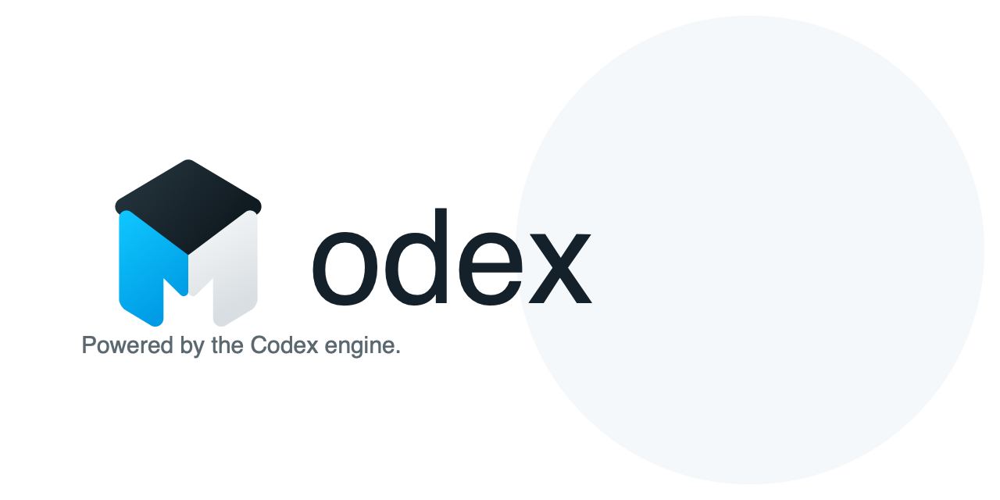

<p align="center">
  
</p>

<p align="center">
  Open-source desktop client powered by the Codex engine.
</p>

<p align="center">
  
  
</p>

> Modex is not affiliated with OpenAI.

Modex is a **native SwiftUI app for macOS** that wraps the upstream Codex engine.
It boots a pinned `codex app-server` as a local subprocess and talks to it over
the app-server JSON-RPC protocol on a loopback WebSocket — no webview, no remote
server. Chat, streamed responses, project history, and git context are all real;
Modex never simulates Codex output.

## Requirements

- **macOS 26** or later (the app targets the macOS 26 SDK / Liquid Glass).
- **Xcode 26** with the macOS 26 SDK.
- **[xcodegen](https://github.com/yonyon/XcodeGen)** — `brew install xcodegen`.
- **Node 24+** — used once to fetch the Codex engine binary.
- A working **Codex login**. Modex uses your local Codex credentials; run
  `codex login` (or configure an API key Codex supports) before chatting.

> Apple Silicon only: the bundled Codex engine is `aarch64-apple-darwin`.

## Build & run

```bash
# 1. Fetch the Codex engine binary the app bundles (writes to src-tauri/binaries/).
npm ci
npm run prepare:codex

# 2. Generate the Xcode project from the committed project.yml.
xcodegen generate --spec macos/project.yml --project macos

# 3. Build (and run) the app.
xcodebuild -project macos/Modex.xcodeproj -scheme Modex \
  -configuration Debug -destination 'platform=macOS' \
  -derivedDataPath macos/build/DerivedData build CODE_SIGNING_ALLOWED=NO
open macos/build/DerivedData/Build/Products/Debug/Modex.app
```

Or open `macos/Modex.xcodeproj` in Xcode and run the **Modex** scheme.

### One-step build + install

`script/install_macos_app.sh` builds the app, installs it to `/Applications`, and
(if the Codex engine binary is missing) fetches it for you first:

```bash
./script/install_macos_app.sh --relaunch
```

Useful flags: `--pull` (git pull first), `--relaunch` (open after install),
`--delay <seconds>`. Honors `MODEX_REPO_PATH` and `MODEX_INSTALL_DIR`.

## Run the tests

```bash
xcodegen generate --spec macos/project.yml --project macos
xcodebuild test -project macos/Modex.xcodeproj -scheme Modex \
  -destination 'platform=macOS'
```

## Codex connection & auth

Modex does **not** store its own credentials and has no account system. It
launches the bundled `codex` engine, which authenticates with your local Codex
setup (`~/.codex/`). If you aren't signed in, a chat turn fails with a clear
"Sign in to Codex" prompt — run `codex login` in a terminal, then resend. Modex
also imports your Codex *trusted* projects from `~/.codex/config.toml` so folders
you already work on appear in the sidebar.

## Configuration

All environment overrides are optional — see [`.env.example`](.env.example):

| Variable | Purpose |
| --- | --- |
| `MODEX_CODEX_BINARY` | Override the Codex engine binary the app launches (dev/testing). |
| `MODEX_REPO_PATH` | Point the in-app self-updater at your Modex checkout. |
| `MODEX_INSTALL_DIR` | Override the install target for `install_macos_app.sh` (default `/Applications`). |
| `CODEX_BINARY` | Override the source binary that `npm run prepare:codex` bundles. |

## Self-update

When Modex runs from a source checkout that has the build toolchain
(`xcodegen` + `xcodebuild`), the account-area footer shows an **Update** control
that pulls, rebuilds, re-signs, and relaunches the app. A shipped/standalone copy
has no source to rebuild from, so the control is hidden there — update by
rebuilding from this repo.

## Known limitations

- Apple Silicon only; no Intel build.
- Local development builds are unsigned (`CODE_SIGNING_ALLOWED=NO`). See
  [`docs/release-signing.md`](docs/release-signing.md) for distribution signing.
- Requires the macOS 26 SDK, which is newer than current hosted CI runners — the
  native build job in CI is non-blocking until those runners are available.

## Legacy Tauri client

An earlier **Tauri + React** prototype of Modex still lives in `src/` and
`src-tauri/` (built with `npm run tauri:dev` / `npm run tauri:build`). It is
**legacy** and no longer the shipping product — the native SwiftUI app above is.
It ships under a distinct bundle id (`dev.modex.desktop.legacy`) so it never
collides with the native app. The `npm run prepare:codex` script it relied on is
kept because it is also how the native app obtains its bundled Codex engine.

## License

MIT — see [`LICENSE`](LICENSE). Bundled third-party notices are in
[`THIRD_PARTY_NOTICES.md`](THIRD_PARTY_NOTICES.md).
